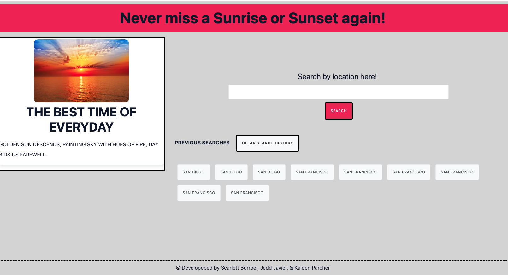

# Never Miss a Sunset or Sunrise Again!

## Technology Used 

HTML
CSS
JavaScript
Cirrus.ui/layout
JQuery
TomTom
GoogleFonts
_.JS

## Description 

The motivation behind this project was to create a webpage that would inform people of the best times to see the sunrises and sunsets. Included in the page was also the sunrise and sunset of the Summer Solstice. Within the webpage, users can search up any city and will receive the exact time at which the sunrises and sets as well the total length of day for the current day and the Summer Solstice.

https://jeppjeppjepp0.github.io/DontEatHere/

## Usage 

The page we created is a very user friendly page that is easy to navigate through and take you straight to the results. Users will go to the site and type in whateer city they'd like, it could be one within their neighborhood or one across the country, and the will immediately receive the exact time for both the current day and the Summer Solstice.

## Credits

Kaiden Parcher https://github.com/Kaidenparcher
Jedd Javier https://github.com/jeppjeppjepp0
Scarlett Borroel https://github.com/Scar919

Third party websites that we used to achieve our results 

https://sunrise-sunset.org/api
https://www.tomtom.com

https://fonts.googleapis.com/css2?family=Bebas+Neue&display=swap
https://use.fontawesome.com/releases/v5.2.0/css/all.css
https://code.jquery.com/jquery-2.2.4.min.js
https://cdn.jsdelivr.net/npm/underscore@1.13.6/underscore-umd-min.js

## License

N/A
